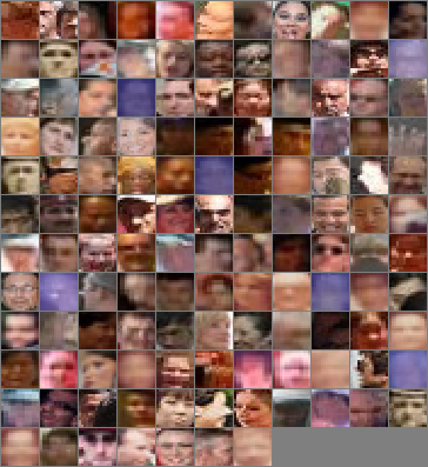
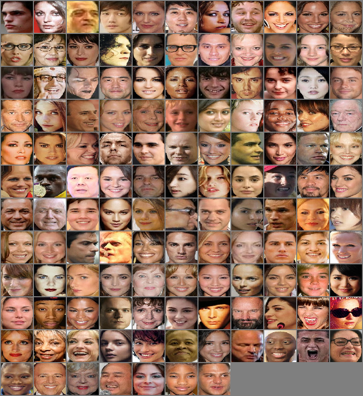

# Face Super-resolution:

1- Generating low and high resolution faces:

1-1 Generating Low resolution faces:

Similar to [[1]](https://www.adrianbulat.com/downloads/ECCV18/image-super-resolution.pdf), 
to generate low resolution faces, we apply  [Single Shot Scale-invariant Face Detector
](https://arxiv.org/pdf/1708.05237.pdf) on [wider dataset](http://shuoyang1213.me/WIDERFACE/
) and select the results with confidence greater than 80% and with maximum(width,heigth) < 37.

An example of the dataset upsampled to (64,64) size.
.

In [this link](https://drive.google.com/file/d/1qeY_q2dMUsdt30V8_TuOVcNc40KbEe17/view?usp=sharing)  you will find the whole low resolution dataset.
It is divided in 49,078 training images and 5,453 testing images.

2-2 Generating High resolution faces:

Similary, we apply  [Single Shot Scale-invariant Face Detector
](https://arxiv.org/pdf/1708.05237.pdf) on [celebA dataset](http://mmlab.ie.cuhk.edu.hk/projects/CelebA.html
) and on [aflw dataset](https://www.tugraz.at/institute/icg/research/team-bischof/lrs/downloads/aflw/)
and select the results with confidence greater than 80% and with min(width,heigth) > 63.

An example of the dataset resized to (64,64) size.
.

In [this link](https://drive.google.com/file/d/1IOH_0hGUvK0FggbdXVAAFC5TsSDHcpQG/view?usp=sharing)  you will find 
the whole high resolution dataset.
It contains 220,818  images.