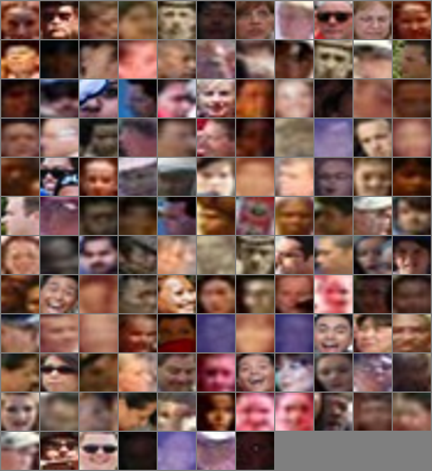
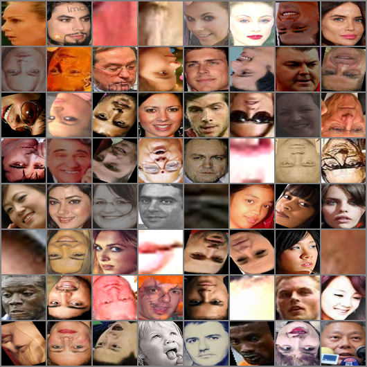

# Face Super-resolution:

1- Generating low and high resolution faces:

1-1 Generating Low resolution faces:

Similar to [[1]](https://www.adrianbulat.com/downloads/ECCV18/image-super-resolution.pdf), 
to generate low resolution faces, we apply  [Single Shot Scale-invariant Face Detector
](https://arxiv.org/pdf/1708.05237.pdf) on [wider dataset](http://shuoyang1213.me/WIDERFACE/
) and select the results with confidence greater than 80% and with maximum(width,heigth) < 37.

An example of the dataset upsampled to (64,64) with bicubic method.
.

In [this link](https://drive.google.com/file/d/1qeY_q2dMUsdt30V8_TuOVcNc40KbEe17/view?usp=sharing)  you will find the whole low resolution dataset.
It is divided in 49,078 training images and 5,453 testing images.

2-2 Generating High resolution faces:

Similary, we apply  [Single Shot Scale-invariant Face Detector
](https://arxiv.org/pdf/1708.05237.pdf) on [celebA dataset](http://mmlab.ie.cuhk.edu.hk/projects/CelebA.html
) and on [aflw dataset](https://www.tugraz.at/institute/icg/research/team-bischof/lrs/downloads/aflw/)
and select the results with confidence greater than 80% and with min(width,heigth) > 63.

An example of the dataset resized to (64,64) size.

.

In [this link](https://drive.google.com/file/d/1IOH_0hGUvK0FggbdXVAAFC5TsSDHcpQG/view?usp=sharing)  you will find 
the whole high resolution dataset.
It contains 220,818  images.

2.BaseLine

2.1 FSRNet

We Use [FSRNet with Gan loss](https://drive.google.com/file/d/10i2NZfUyf2Yold4ABusz3Que-XN_gEEu/view) on wider dataset and
with the network trained with [celebA dataset](http://mmlab.ie.cuhk.edu.hk/projects/CelebA.html) 
as our baseline.
 
3.Method:

3.1 Overall Architecture:

We use two generator and one discriminators: The first generator called high to low generator is used 
to create low resolution data from high resolution input; it's combined with the  discriminator called
Low Resolution Discriminator.

The second generator called low to high generator takes the output of the high to low generator as input and
produce a high resolution image.

The overall architecture is presented in the figure below.

 

3.2 High to Low Generator:

The H2L Generator follow an encoder decoder like architecture with two skip connections.
We concatenate the input image with a 1 channel image generated by passing a normal ditribution to 
a fully connected layer.

The architecture is presented in the figure below.

 

3.3 Low to High Generator:

Similar to the H2L Generator; the L2H generator follows an encoder decoder architecture with more skip connections
and an overall skip connection between the input and output.

The architecture is presented in the figure below.

 

3.4 LR discriminator

The architecture of the low resolution discriminator is presented in the figure below.

 

4.Results

Our method compared with [FSRNet with Gan loss ](https://drive.google.com/file/d/10i2NZfUyf2Yold4ABusz3Que-XN_gEEu/view)  that
is trained on [celebA dataset](http://mmlab.ie.cuhk.edu.hk/projects/CelebA.html) 

Input                     | FSRNET                   | Ours                    |Input| FSRNET|Ours|Input|FSRNET|Ours
:-------------------------:|:------------------------:|:------------------------:|:----------------------:|:--------:|:---------------:|:------------:|:----------------:|:-------------------- 
 |   |   |   |   |  |  |   | 
 |   |   |   |   |   |  |   | 
 |   |   |   |   |  |  |   | 
 |   |   |   |   |  |  |   | 
 |   |   |   |   |   |  |   |  
 |   |   |   |   |   |  |   | 
 |   |   |   |   |  |  |   | 
 |   |   |   |   |  |  |   | 
 |   |   |   |   |  |  |   | 
 |   |   |   |   |  |  |   | 
 
 5.Results with a discriminator for High resolution image generation
 
 Input                     | FSRNET                   | Ours                    |Input| FSRNET|Ours|Input|FSRNET|Ours
:-------------------------:|:------------------------:|:------------------------:|:----------------------:|:--------:|:---------------:|:------------:|:----------------:|:-------------------- 
 |   |   |   |   |  |  |   | 
 |   |   |   |   |   |  |   | 
 |   |   |   |   |  |  |   | 
 |   |   |   |   |  |  |   | 
 |   |   |   |   |   |  |   |  
 |   |   |   |   |   |  |   | 
 |   |   |   |   |  |  |   | 
 |   |   |   |   |  |  |   | 
 |   |   |   |   |  |  |   | 
 |   |   |   |   |  |  |   | 
 
 
 6.Citer Data Results
 
 You will find the results for 71 subjects and named appropriatly in 
 [the following directory](images/citer/images/).
 
 Input                     | Output                   | Input                    |Output
:-------------------------:|:------------------------:|:------------------------:|:----------------------:
 |   |   |  
 |    |   |   
  |   |  |   
  |   |  |  

7.Grayscale images results

Images found at  [the following directory](images/grayscale/).

Input                     | Output                   | Input                    |Output
:-------------------------:|:------------------------:|:------------------------:|:----------------------:
 |   |   |  
 |   |   |  
 |   |   |  
 |   |   |  
 |   |   |  
 |   |   |  
 |   |   |  
 |   |   |  
 |   |   |  
 |   |   |  
 |   |   |  
 |   |   |  
 |   |   |  
 |   |   |  
 |   |   |  

 5.Results with a discriminator for High resolution image generation x8

 Input                     | FSRNET                   | Ours                    |Input| FSRNET|Ours|Input|FSRNET|Ours
:-------------------------:|:------------------------:|:------------------------:|:----------------------:|:--------:|:---------------:|:------------:|:----------------:|:--------------------
 |   |   |   |   |  |  |   | 
 |   |   |   |   |   |  |   | 
 |   |   |   |   |  |  |   | 
 |   |   |   |   |  |  |   | 
 |   |   |   |   |   |  |   | 
 |   |   |   |   |   |  |   | 
 |   |   |   |   |  |  |   | 
 |   |   |   |   |  |  |   | 
 |   |   |   |   |  |  |   | 
 |   |   |   |   |  |  |   | 

